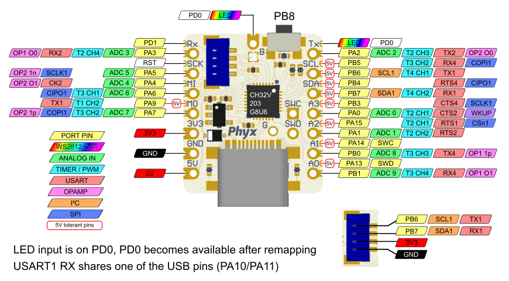

# LANA TNY
## LANA
LANA is a small development board based around the [WCH CH32V203](https://www.wch-ic.com/products/CH32V203.html) RISC-V microcontroller.

## Programming

### Writing code
Various options are available.
- [Embeetle](https://embeetle.com/)
- [CH32V003fun](https://github.com/cnlohr/ch32v003fun)
- [Arduino core](https://github.com/openwch/arduino_core_ch32)
	- Experimental support for the CH32V203 at the time of writing
- [Platform.io](https://github.com/Community-PIO-CH32V/platform-ch32v)
- [MounRiver Studio](https://www.mounriver.com/)
	- The official IDE supported by WCH, based on Eclipse.

### Loading code
The CH32V203 has an USB Bootloader which can be activated by holding down the button when plugging in the USB cable. Alternatively you could opt to use a [WCH-Link programmer and debugger](https://www.wch.cn/products/WCH-Link.html) to connect to the exposed SWD pins.

## TNY ?
TNY is our take on the [Adafruit QT Py](https://www.adafruit.com/category/595) and [Seeed studio XIAO](https://wiki.seeedstudio.com/Seeeduino-XIAO/) specifiactions but with added SMD pins for optional extra IO capabilities and a built in WS2811 compatible LED output.

## Pinout

## LANA REV 01

